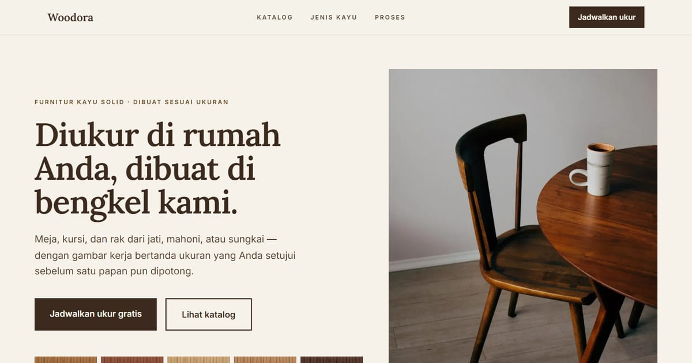

# Woodora — Furnitur Kayu Solid Sesuai Ukuran

Woodora membuat meja, kursi, dan rak dari jati, mahoni, dan sungkai sesuai ukuran ruang Anda — dengan gambar kerja bertanda ukuran sebelum kayu dipotong. Ukur ke rumah gratis.

**Demo live:** https://landing-woodora.vercel.app



> Template landing page untuk bisnis fiktif. Formulir di dalamnya hanya demo dan tidak mengirim data.

## Konsep

Bahasa rupa **Lembar Kayu**: perabot dijual lewat serat dan ukuran, jadi rupanya meniru lembar kerja tukang dengan linen, walnut, dan garis ukur.

## Halaman

- `/` — beranda: katalog bergambar kerja, proses, contoh serat kayu, formulir ukur dengan pratinjau ukuran langsung, FAQ
- `/katalog` — enam perabot dikelompokkan per ruang
- `/katalog/[slug]` — gambar kerja tampak depan & samping, pilihan kayu, yang bisa diubah
- `/jenis-kayu` — panduan lima kayu: kekerasan, kestabilan, harga relatif, asal

## Teknologi

- Next.js 15.5 (App Router) dan React 19
- Tailwind CSS v4
- JavaScript
- Gambar kerja SVG & contoh serat kayu CSS (tanpa pustaka ikon/animasi)
- Font: Lora, Inter (next/font)
- SEO: metadata per halaman, Open Graph, JSON-LD, sitemap.xml, dan robots.txt

## Menjalankan secara lokal

```bash
npm install
npm run dev
```

Buka http://localhost:3000. Untuk build produksi: `npm run build` lalu `npm start`.

## Kredit foto

Foto suasana berlisensi **CC0 (domain publik)** dari StockSnap dan rawpixel; perabot di foto bukan produk Woodora.

- `public/images/foto/kursi-meja.webp` — "Wooden Chair" oleh Ryan Riggins ([sumber](https://stocksnap.io/photo/wooden-chair-0DH6S6OU6Q)).
- `public/images/foto/ukur.webp` — "Calipers Carpenter" oleh James Frid ([sumber](https://stocksnap.io/photo/calipers-carpenter-GWIDWSKJJJ)).
- `public/images/foto/permukaan.webp` — "Wooden Table" oleh STIL ([sumber](https://stocksnap.io/photo/wooden-table-UDK1VY8Z8J)).
- `public/images/foto/amplas.webp` — "woodworker working slab wood workshop" ([sumber](https://www.rawpixel.com/image/3304149/free-photo-image-cc0-creative-commons)) — rawpixel, CC0.

---

Bagian dari koleksi 17 template landing page di [PortalLanding](https://portal-landing-seven.vercel.app). Dibuat oleh [PintuWeb](https://pintuweb.com), jasa pembuatan website.
